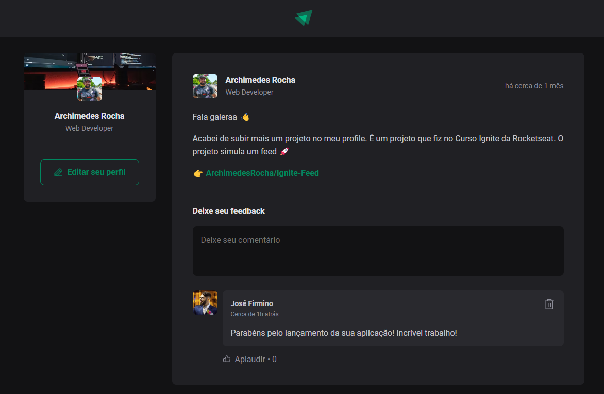

### Banner do projeto



### Shortcuts

<p align="left">
 <a href="#titulo-do-projeto">Título do projeto</a> •
 <a href="#resumo">Resumo</a> • 
 <a href="#status-do-projeto">Status do Projeto</a> • 
 <a href="#features">Features</a> • 
 <a href="#-rodando-o-projeto">Rodando o projeto</a> • 
 <a href="#autor">Autor</a> • 
 <a href="#mit-license">Lisença</a>
</p>

### Título do projeto

Feed Dev

### Resumo

Projeto desenvolvido apartir do curso da RocketSeat que simula a construção de uma página de feedback, neste projeto aprendi sobre os conceitos mais importantes do React, entre eles estão componentização, propriedades, estados, imutabilidade e hooks, além de aplicar Typescript, assim adicionando tipagem estática à aplicação.

### Status do Projeto

<h4 align="left"> 
	🚧  Feed Dev 🚀 Finalizado...  🚧
</h4>

### Features

- [x] Deve adicionar comentários
- [x] Deve excluir comentários
- [x] Deve permitir o usuário apludir(like) a postagem
- [x] Deve não permitir adicionar comentários vazios

### Pré-requisitos

Antes de começar, você vai precisar ter instalado em sua máquina as seguintes ferramentas:
[Git](https://git-scm.com), [Node.js](https://nodejs.org/en/). 
Além disto é bom ter um editor para trabalhar com o código como [VSCode](https://code.visualstudio.com/)

### 🎲 Rodando o projeto
```bash
# Clone este repositório
$ git clone <https://github.com/ArchimedesRocha/Project_Feed_Dev>

# Acesse a pasta do projeto no terminal/cmd
$ cd Ignite-Feed

# Instale as dependências
$ npm install

# Execute a aplicação em modo de desenvolvimento
$ npm run dev

# O servidor inciará na porta:3333 - acesse <http://localhost:3333>
```

### Autor

Olá sou Archimedes Rocha, apaixonado por tecnologia e um eterno estudante.

<h3>:speech_balloon: Quer conversar? Me chama por aqui</h3>

[](https://www.linkedin.com/in/archimedes-rocha-81334827/)
[](https://api.whatsapp.com/send?phone=+5582988861433&text=Hello!)
[](mailto:dev.archimedesrocha@gmail.com)

### MIT License

Copyright ©️ 2024 Archimedes Rocha

Permission is hereby granted, free of charge, to any person obtaining a copy
of this software and associated documentation files (the "Software"), to deal
in the Software without restriction, including without limitation the rights
to use, copy, modify, merge, publish, distribute, sublicense, and/or sell
copies of the Software, and to permit persons to whom the Software is
furnished to do so, subject to the following conditions:

The above copyright notice and this permission notice shall be included in all
copies or substantial portions of the Software.

THE SOFTWARE IS PROVIDED "AS IS", WITHOUT WARRANTY OF ANY KIND, EXPRESS OR
IMPLIED, INCLUDING BUT NOT LIMITED TO THE WARRANTIES OF MERCHANTABILITY,
FITNESS FOR A PARTICULAR PURPOSE AND NONINFRINGEMENT. IN NO EVENT SHALL THE
AUTHORS OR COPYRIGHT HOLDERS BE LIABLE FOR ANY CLAIM, DAMAGES OR OTHER
LIABILITY, WHETHER IN AN ACTION OF CONTRACT, TORT OR OTHERWISE, ARISING FROM,
OUT OF OR IN CONNECTION WITH THE SOFTWARE OR THE USE OR OTHER DEALINGS IN THE
SOFTWARE.
